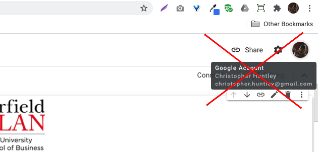
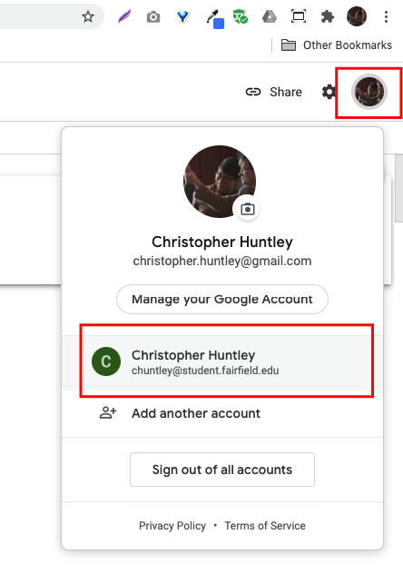
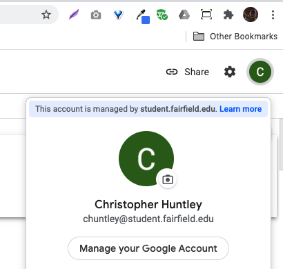
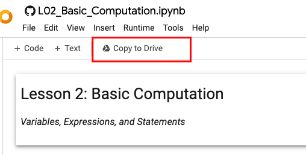
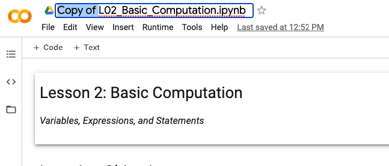
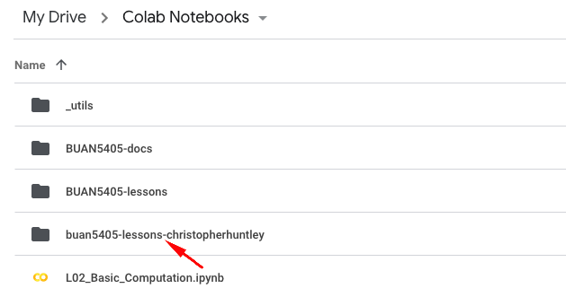
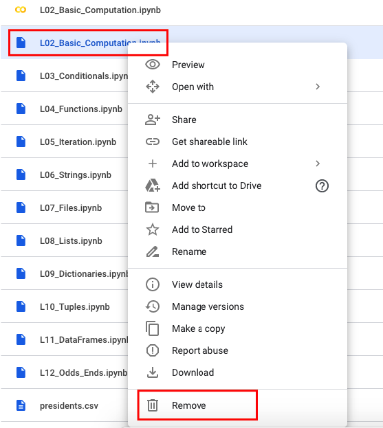
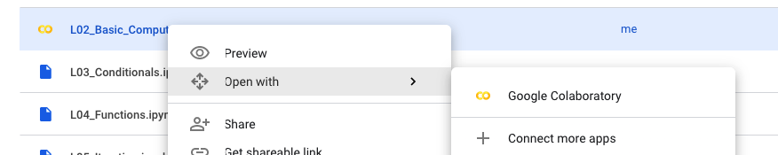

# Fix for 400 Error when Opening a Notebook from Google Drive

If you have multiple Google accounts it is easy for Colab and Google Drive to get confused. Google Drive has to **allow** Colab to open the file. It's possible that you allowed Colab to write the file from within Colab but didn't give it permission to read to file from Google Drive.

Here is a solution that will fix is once and for all. Repeat it for _each file_ you cannot open in Google Drive.

## Step 1. Open a Notebook from your repository in GitHub.

Right-click a notebook from this list to open a fresh copy in a new tab:
- [Lesson 1](https://colab.research.google.com/github/christopherhuntley/BUAN5405-lessons/blob/master/L01_Preliminaries.ipynb) Preliminaries 
- [Lesson 2](https://colab.research.google.com/github/christopherhuntley/BUAN5405-lessons/blob/master/L02_Basic_Computation.ipynb)  Basic Computation
- [Lesson 3](https://colab.research.google.com/github/christopherhuntley/BUAN5405-lessons/blob/master/L03_Conditionals.ipynb)  Conditionals
- [Lesson 4](https://colab.research.google.com/github/christopherhuntley/BUAN5405-lessons/blob/master/L04_Functions.ipynb)  Functions
- [Lesson 5](https://colab.research.google.com/github/christopherhuntley/BUAN5405-lessons/blob/master/L05_Iteration.ipynb)  Iteration
- [Lesson 6](https://colab.research.google.com/github/christopherhuntley/BUAN5405-lessons/blob/master/L06_Strings.ipynb)  Strings
- [Lesson 7](https://colab.research.google.com/github/christopherhuntley/BUAN5405-lessons/blob/master/L07_Files.ipynb)  Files
- [Lesson 8](https://colab.research.google.com/github/christopherhuntley/BUAN5405-lessons/blob/master/L08_Lists.ipynb)  Lists
- [Lesson 9](https://colab.research.google.com/github/christopherhuntley/BUAN5405-lessons/blob/master/L09_Dictionaries.ipynb)  Dictionaries
- [Lesson 10](https://colab.research.google.com/github/christopherhuntley/BUAN5405-lessons/blob/master/L10_Tuples.ipynb) Tuples
- [Lesson 11](https://colab.research.google.com/github/christopherhuntley/BUAN5405-lessons/blob/master/L11_DataFrames.ipynb) DataFrames 
- [Lesson 12](https://colab.research.google.com/github/christopherhuntley/BUAN5405-lessons/blob/master/L12_Odds_Ends.ipynb) Odds and Ends
- [Lesson 13](https://colab.research.google.com/github/christopherhuntley/BUAN5405-lessons/blob/master/L13_Final_Project.ipynb) Final Project

## Step 2: In Colab, make 100% sure you are using the right Google account. 
You likely have your default Google account set to your personal gmail, not your student.fairfield.edu one. In Colab that looks like this:

The default account is shown at the top right. Just below it you see the same account being used by Colab. Neither is the one we want. Click the account icon in Colab to switch your student account. 

If you don't see your student account listed, then add it.

Once you have the account switched Colab should look something like this when you click on the account icon:

## Step 3. Copy to Google Drive. 
Click the "Copy to Drive" button just below the "Runtime" menu. Your notebook will open in a copy in Google Drive. 

## Step 4. Rename the Notebook.
The notebook with have "Copy of " in the name. Double click on the filename and delete that extra text so that the name matches the original.

## Step 5. In Google Drive, open the Colab Notebooks folder and drag the file into your lessons folder. 

## Step 6. Remove any old copies.

## Step 7. Open the new file in Colab. 

